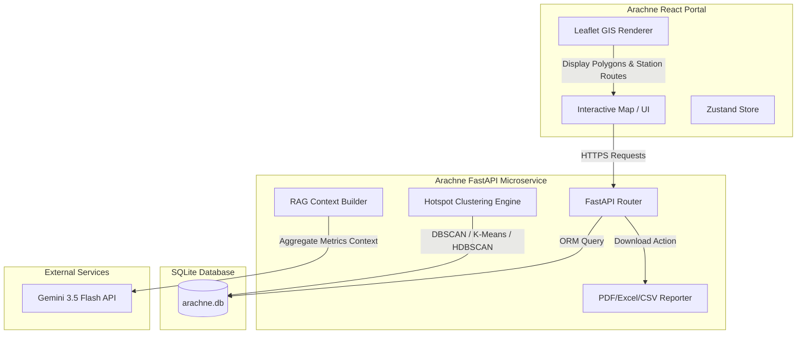

# 🕷️ ARACHNE: Spatial-Temporal Tactical Intelligence System

ARACHNE is an open-source, high-performance spatial-temporal tactical crime intelligence dashboard. It leverages advanced clustering algorithms (DBSCAN, K-Means, HDBSCAN) for dynamic hotspot detection, integrates the Gemini 3.5 Flash API for non-hallucinatory RAG cognitive intelligence briefings, and provides professional reporting download pipelines (PDF, Excel, CSV) for law enforcement officers and administrators.

---

## 📐 1. Architecture Diagram



---

## 📁 2. Folder Structure

```text
Arachne/
├── README.md                  # Project overview & documentation
├── package.json               # Frontend dependencies & scripts
├── tsconfig.json              # TypeScript compilation config
├── Dockerfile                 # Frontend multi-stage production build
├── docker-compose.yml         # Multi-container service orchestrator
├── src/                       # Frontend source code
│   ├── app/                   # Next.js Pages & routing
│   ├── components/            # React UI components
│   │   ├── Map/               # GIS leaflet maps & controls
│   │   └── views/             # Dashboard, Database, Reports views
│   ├── services/              # API REST connections
│   └── store/                 # Zustand state managers
└── arachne-backend/           # Backend source code
    ├── requirements.txt       # Python dependencies list
    ├── test_suite.py          # Unified case validation suite
    ├── Dockerfile             # Python production container build
    └── app/                   # FastAPI source module
        ├── config/            # Server settings loader
        ├── middlewares/       # Security headers & rate limiter
        ├── models/            # SQLAlchemy database tables
        ├── routers/           # REST endpoints
        ├── schemas/           # Pydantic validation boundaries
        └── services/          # Hotspots & Gemini API handlers
```

---

## 🚀 3. Installation Guide

### Prerequisites
*   Node.js (v20+)
*   Python (3.11+)
*   Docker & Docker Compose (Optional, for containerized run)

### 3.1 Local Development Environment

#### Step 1: Run the Backend Microservice
1. Navigate to the backend directory:
   ```bash
   cd arachne-backend
   ```
2. Create and activate a Python virtual environment:
   ```bash
   python -m venv venv
   # Windows:
   .\venv\Scripts\activate
   # Linux/macOS:
   source venv/bin/activate
   ```
3. Install dependencies:
   ```bash
   pip install -r requirements.txt
   ```
4. Configure environment variables in `.env`:
   ```env
   GEMINI_API_KEY=your_gemini_api_key_here
   SECRET_KEY=generate_a_random_jwt_encryption_key
   ```
5. Launch the backend server:
   ```bash
   python -m uvicorn app.main:app --host 0.0.0.0 --port 8000 --reload
   ```

#### Step 2: Run the Frontend Portal
1. Navigate to the frontend root folder:
   ```bash
   cd ..
   ```
2. Install npm packages:
   ```bash
   npm install
   ```
3. Launch Next.js portal:
   ```bash
   npm run dev -- -p 3001
   ```
4. Access the portal at: `http://localhost:3001`

### 3.2 Running via Docker Compose (Recommended for Production)
Build and spin up the multi-container stack in detached mode:
```bash
docker-compose up -d --build
```
*   Frontend: `http://localhost:3000`
*   Backend: `http://localhost:8000`

---

## 📑 4. API Documentation

| Endpoint | Method | Security | Description |
| :--- | :--- | :--- | :--- |
| `/api/v1/auth/token` | POST | Public | Authenticates credentials, sets Secure/HttpOnly refresh cookies. |
| `/api/v1/auth/refresh`| POST | Public | Validates refresh cookie and issues rotated JWT tokens. |
| `/api/v1/geo/incidents`| GET | JWT (SHO/Comm) | Retrieves all logged case records with geolocations. |
| `/api/v1/geo/predict-patrols` | GET | JWT (SHO/Comm) | Runs clustering algorithms to extract active hotspots. |
| `/api/v1/ai/insights/chat` | POST | JWT (SHO/Comm) | Performs RAG-based search to answer queries using Gemini. |
| `/api/v1/reports/download/pdf` | GET | JWT (SHO/Comm) | Generates and downloads the professional PDF briefing report. |
| `/api/v1/reports/schedules` | POST | JWT (SHO/Comm) | Schedules automatic email reports. |

---

## 🧮 5. Machine Learning (ML) & Clustering

Arachne extracts predictive police beats dynamically using spatial-temporal clustering estimators:
*   **DBSCAN**: Density-based clustering that isolates dense hubs of incidents and automatically filters out outlier noise. Perfect for detecting high-density crime spots.
*   **K-Means**: Partitions incidents into exactly `k` spatial clusters using centroid distance minimization.
*   **HDBSCAN**: Hierarchical density clustering mapping clusters of varying densities.
*   **Station Routing**: For every computed hotspot, the backend automatically calculates the nearest police precinct coordinates using Euclidean distance and plots dispatch patrol routing.

---

## 🧠 6. AI RAG & Non-Hallucination Framework

To maintain strict truth-telling standards (OWASP A09):
1.  **Factual Aggregator**: Every query triggers the backend to compile a telemetry snapshot containing exact counts, timeline trends, district breakdowns, and active hotspot centroid parameters.
2.  **Context-Locked Instructions**: The Gemini 3.5 Flash engine is instructed to answer *only* using the compiled context.
3.  **Fallback Policy**: If the requested query lies outside the telemetry database (e.g. data for a non-existing month), the model is instructed to state that the requested data is not logged in the registry, avoiding generic hallucinations.

---

## 📊 7. Dataset Details

Upon startup, if the database holds fewer than 10 incident logs, the database seeder automatically generates **150 spatial-temporal crime records** centered around Bangalore, India (e.g., Koramangala, Indiranagar, Central District, etc.).
*   **Categories**: `Armed Robbery`, `Assault`, `Theft`, `Cyber Fraud`.
*   **Temporal Shifts**: `Day` / `Night`.
*   **District Sectors**: `Central`, `North`, `East`, `South`.

---

## 🧪 8. Case Validation & Test Suite

Run the automated test suite to verify the operational health and security headers compliance of the backend:
```bash
cd arachne-backend
.\venv\Scripts\python.exe -u test_suite.py
```

---

## 🤝 9. Contribution & License

Contributions are welcome! Please follow these guidelines:
1.  Ensure all modifications pass typescript compilations: `npx tsc --noEmit`.
2.  Write unit tests inside `test_suite.py` for any new endpoints.
3.  Open a Pull Request with a detailed log of additions.

### License
Distributed under the **MIT License**. See `LICENSE` for more information.
